# Primordia

**A GPU artificial-life laboratory in Rust + wgpu.** Millions of slime-mould agents weave living transport networks. Particle species with asymmetric attractions self-assemble into cells and serpents. Continuous cellular automata hatch soft, gliding organisms. Reaction-diffusion chemistry paints coral, fingerprints and spiral waves. Everything simulates in real time on compute shaders and is rendered as living light, and you can poke at all of it with the mouse.

[](LICENSE)


<p align="center">
  <picture>
    <source srcset="docs/images/hero.webp" type="image/webp">
    
  </picture>
</p>

Primordia is a playground for **emergence** and **self-organisation**. It has four classic artificial-life (ALife) systems plus **Symbiosis**, an experiment that couples agents and chemistry, **42 presets** and a *Mutate* button for exploring new settings. A cinematic HDR pipeline is shared by all five worlds. Use it as a screensaver, a generative-art tool, a teaching aid for agent-based models and cellular automata, or as a starting point for your own GPU simulations.

- [The five worlds](#the-five-worlds)
- [Features](#features)
- [Quick start](#quick-start)
- [Controls](#controls)
- [Rendering without a window](#rendering-without-a-window)
- [Exploring by novelty](#exploring-by-novelty)
- [Scripting and automation](#scripting-and-automation)
- [Troubleshooting](#troubleshooting)
- [How it works](#how-it-works)
- [Inspiration and references](#inspiration-and-references)

## The five worlds

### 1 · Physarum (slime mould)


A multi-species version of Jeff Jones' *Physarum polycephalum* agent model, in the spirit of Sage Jenson's work. About **3-6 million agents** (at 1080p) sense the chemical trail ahead of them, steer toward it and deposit more. Out of that loop grow self-optimising transport networks: white-hot arteries fed by fine capillaries that keep remodelling. Up to four species attract or repel each other through an interaction matrix and fight over territory. Left-click drops food; right-click repels.

**Presets:** Dendrites · Neural Lace · Mycelium · Rival Colonies · Symbiosis · Honeycomb · Synapses · Currents · Chasing Waves · Galaxy

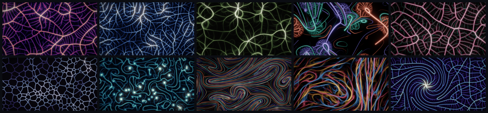

### 2 · Particle Life

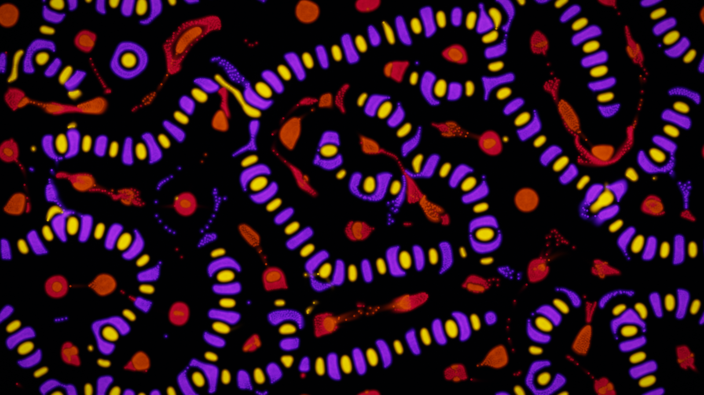

Particle life after Jeffrey Ventrella's *Clusters* and Tom Mohr: up to 8 species, each with its own asymmetric attraction or repulsion toward every other species. Those simple pairwise rules produce membranes, cells, serpents, rotating suns and predator-prey chases. Neighbour search is a GPU uniform grid rebuilt every step, and forces are summed in fixed point, so every run replays exactly from its seed. Left-click attracts; right-click scatters.

**Presets:** Tidepool · Living Cells · Serpents · Rotating Suns · Lace · Marbling · Predator & Prey · Plankton · Necklaces

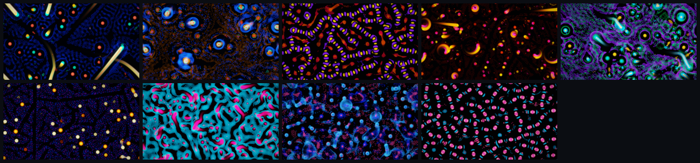

### 3 · Lenia

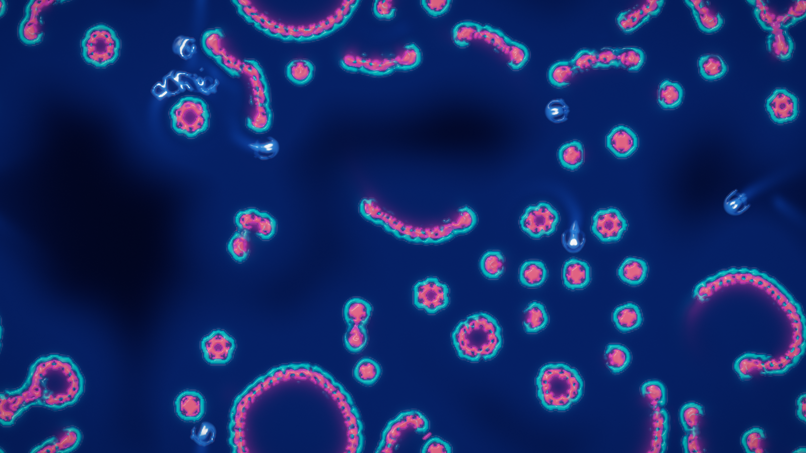

Bert Chan's Lenia, a continuous cellular automaton, in its multi-channel, multi-kernel "expanded" form: up to 3 channels and 16 kernels. The classic **Orbium** gliders are hatched from the published pattern and released at random headings. Around them live giants and minnows, pearl reefs that grow into rings, the worm colonies of *Hydrogeminium* and the gyrating *Tessellatium*. Left-click paints life; right-click erases it.

**Presets:** Orbium · Leviathans · Menagerie · Pearl Reef · Necklaces · Hydrogeminium · Tessellatium

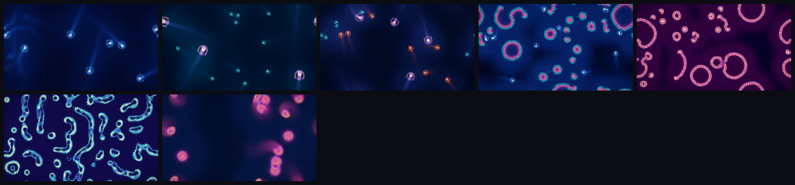

### 4 · Reaction-Diffusion (Gray-Scott)

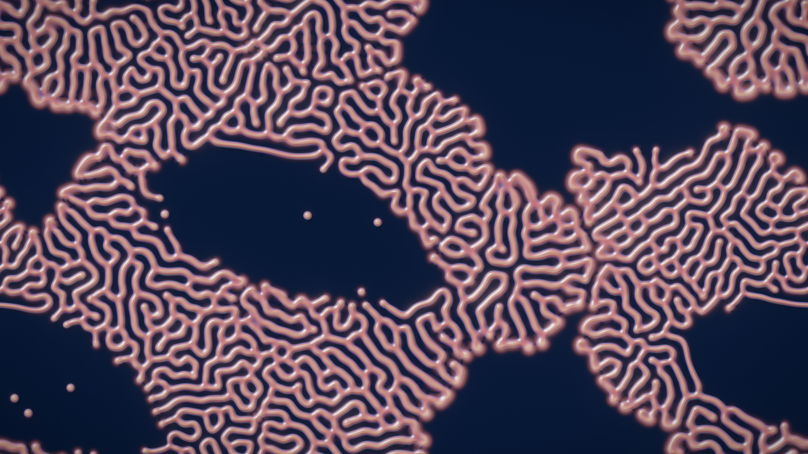

Two virtual chemicals, U and V, react (`U + 2V → 3V`) and diffuse. Depending on the feed and kill rates, that gives coral, dividing cells, fingerprints, worms, solitons, crescent gliders, spiral waves or soap-film foam. Slow, periodic "weather" keeps every pattern alive and evolving. The *Morphology Atlas* preset sweeps feed and kill across space, so the whole Pearson zoo lives on one seamless torus. The field is lit as a height map in one of five materials, including thin-film nacre and ink on paper. Left-click seeds chemistry; right-click erases.

**Presets:** Coral Reef · Mitosis · Fingerprints · Worms · Solitons · Crescent Gliders · Spiral Waves · Bubbles · Spots & Stripes · Morphology Atlas

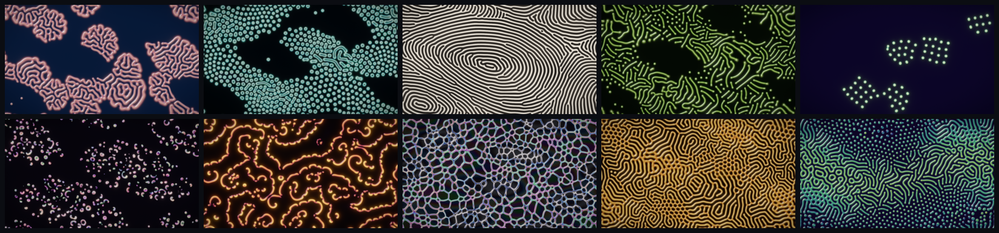

### 5. Symbiosis

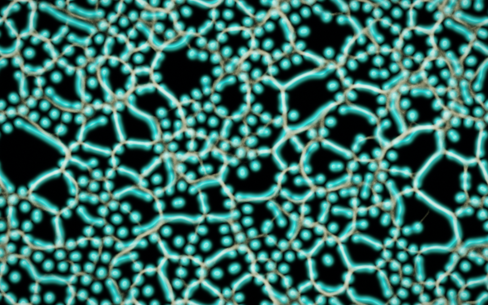

A coupled-world experiment with three **Relationships**. **Cultivate** agents tend growth margins and nourish colonies. **Graze** agents pursue and consume growth, leaving depleted routes behind them. **Weave** agents germinate new growth along their busiest trails. Both directions respond to one **Coupling strength** slider; at zero, chemistry and agents keep running independently. This uses a dedicated shared habitat, with a bounded grid to keep larger displays responsive.

The presets explore different growth scales, steering and chemical regimes:

| Preset | Relationship | Character |
|---|---|---|
| Living Reef | Cultivate | Broad colonies, folded margins and fine supporting trails |
| Wandering Veins | Graze | Small moving crescents pursued by roaming agents |
| Coral Maze | Weave | Fine, branching mazes mixed with cellular patches |
| Spore Tide | Graze | Broken fronts curl into travelling waves and spirals |
| Root Atlas | Weave | Large, persistent routes become corridors of chemical growth |
| Fallow Gardens | Weave | Busy routes exhaust the ground; rested patches slowly regain fertility |

**Habitat & growth** controls the pattern scale and a seamless fertility landscape generated from the seed. Choose scattered islands, clustered colonies, living threads or broken wave fronts, then **Restart this seed** to apply the seeding layout. **Mutate** explores these layouts, scale, geography, agent behaviour and fertility cycles across all six preset families. **Trail light**, under Look, balances the visible network against the chemistry.

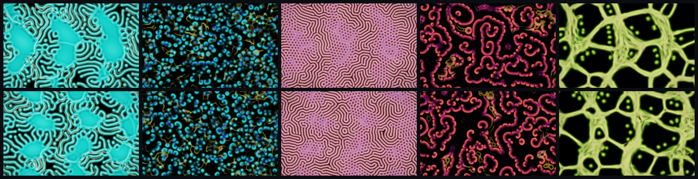

Switch the **View** between Together, Chemistry, Agent trails and Fertility to inspect the interaction. Changes to the relationship and coupling take effect immediately; the existing habitat carries its history forward. Left-drag seeds chemistry; right-drag clears chemistry and trails. The library keeps the relationship, habitat, seed, settings, palette and view. Earlier recipes retain their original cultivation behaviour, uniform habitat and seeding settings.

Enable **Compare habitats** to restart two habitats from the same seed. The left uses your settings; choose **Coupling off** or **Fertility cycle off** for the right-hand reference. The latter keeps agent–chemistry coupling intact and removes only depletion and its effects. All other settings, brush strokes, pan and zoom are shared. Changing the reference or choosing **Restart comparison** repeats the experiment from that seed with your current settings; turning comparison off keeps the left habitat running. The mode and reference are saved with your recipe; earlier comparison saves retain their coupling-off reference. Press **H / Tab** to give both panes more room. Comparison runs two simulations, so it uses more GPU time and memory.

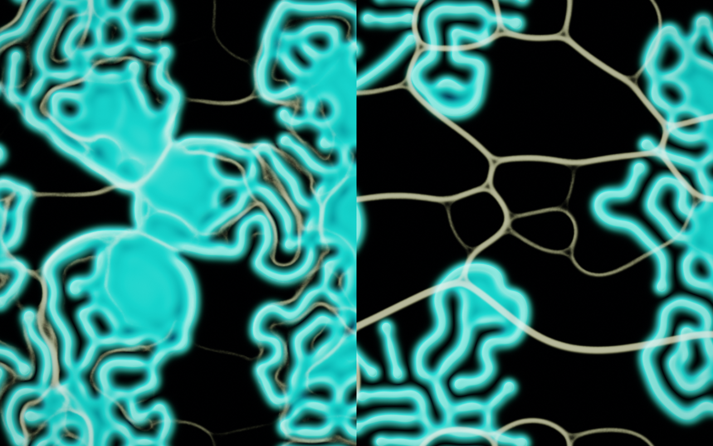

**Fertility cycle** gives the ground a slower memory. Concentrated traffic depletes local reserves, increasing chemical loss and making new growth harder to germinate. When traffic moves away, fertility gradually returns. **Depletion strength** controls the effect; zero bypasses it. **Recovery time (s)** is the time to recover about 63% of missing fertility on rested ground at 60 simulation frames per second. It follows simulation frames, pauses with the world, and is independent of chemistry steps and growth scale. Coupling at zero also removes depletion and its effects.

The **Fertility** view uses rust for exhausted ground and teal for fertile ground, with faint colony outlines. Clearing chemistry leaves this history intact; restarting restores full reserves. Saved recipes retain the cycle settings but restart the habitat, just like other library saves. The five earlier presets and older recipes keep depletion off; **Fallow Gardens** starts with it enabled and selects the fertility-off reference for comparison.

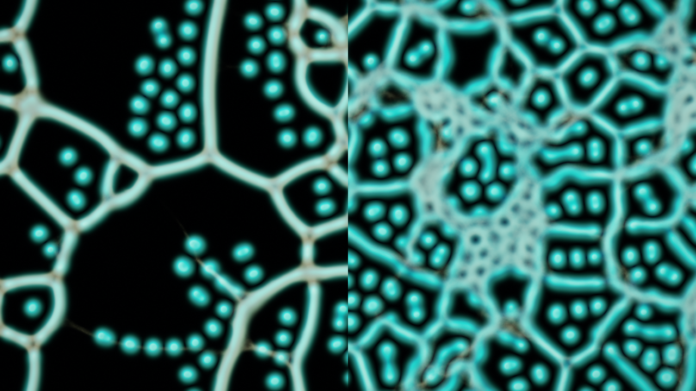

The same moment in the fertility view shows depleted routes on the left; the reference keeps full reserves. In this seed-42 experiment, the cycle leaves larger open regions between routes while the reference develops a denser mesh. Both habitats remain active through 7200 frames (two minutes at 60 frames/s).

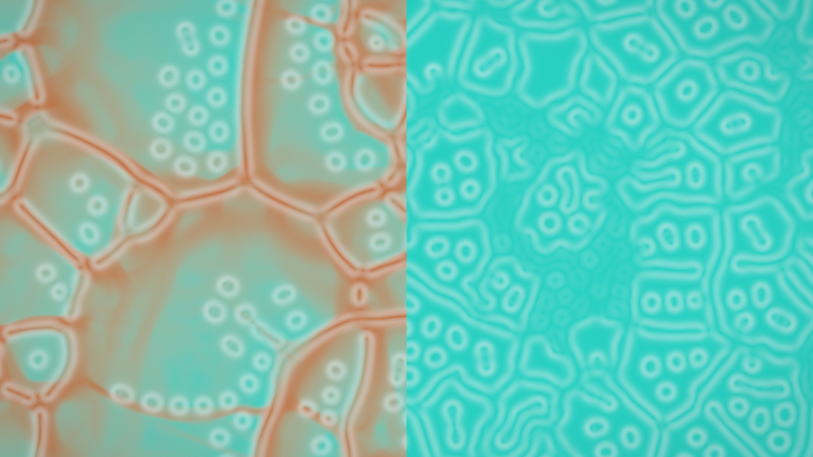

```bash
cargo run --release -- --world symbiosis --preset "Living Reef"
primordia render --world symbiosis --preset "Wandering Veins" --seed 42 --frames 720 --out symbiosis.png
cargo run --release -- --world symbiosis --preset "Fallow Gardens" --seed 42
```

## Features

- **Real-time GPU simulation** in WGSL compute shaders (see [Performance](#performance) for measurements of the four original worlds).
- **42 presets** and **Mutate** (`M`) for exploring new parameter sets.
- **Interactive.** Paint, feed, attract, repel and erase with the mouse. Zoom into any detail, and pan across the seamless toroidal world.
- **Cinematic look.** HDR bloom (the Jimenez 13-tap chain with level falloff), AgX, ACES or Reinhard tonemapping, perceptual OKLab palettes, vignette, film grain and dithering.
- **Live control panel** (egui) exposing every parameter of every world.
- **Live measurements.** Every world reduces a few scalars of its state on the GPU each frame (coverage, mean concentrations, activity, clustering, fertility) and plots them as sparklines in the panel; log them to CSV from the app or with `primordia render --metrics`.
- **Exploration by novelty.** `primordia explore` runs dozens of mutations headlessly, measures each one, keeps the most mutually different behaviours (or the extremes of one metric) and hands back images, a contact sheet and recipes for your library.
- **Saved worlds library.** Name and keep your discoveries, including their seed, all world settings, colours, post effects and camera view.
- **Tour mode** (`T`): a screensaver that fades through every preset of every world.
- **Screenshots** (`F12`) and **MP4 recording** (`V`) straight from the app.
- **Headless rendering.** PNGs, frame sequences, MP4s, galleries and captioned contact sheets from the command line, repeatable from a seed on the same GPU. A scripted mouse lets you test interactions too.
- **Recipes you can share.** Every PNG that Primordia writes carries its recipe, so `primordia render --recipe picture.png` renders it again; `--set` changes any setting from the command line.
- **Scriptable.** `primordia list --json` describes every world without a GPU, `--json` prints one result object, and exit codes tell input errors, GPU failures and missing ffmpeg apart.
- **Kind to smaller GPUs.** Integrated GPUs start at half simulation resolution; **Tools → Simulation resolution** changes it at any time.
- **Extensible.** A small `World` trait; see [docs/WRITING_A_WORLD.md](docs/WRITING_A_WORLD.md).

## Quick start

You need a GPU with Vulkan, DirectX 12 or Metal. [ffmpeg](https://ffmpeg.org) is optional and is only used for video.

**Windows:** download the executable from the [latest release](https://github.com/skulitom/primordia/releases/latest) and run it. It is not code-signed, so SmartScreen may ask you to choose **More info → Run anyway**.

**Any platform, with Rust 1.86 or newer:** install the `primordia` command that the examples in this README use,

```bash
cargo install --locked --git https://github.com/skulitom/primordia
primordia
```

or build and run it from a clone:

```bash
git clone https://github.com/skulitom/primordia
cd primordia
cargo run --release
```

Jump straight to a world or preset, or start the screensaver:

```bash
cargo run --release -- --world lenia --preset "Pearl Reef"
cargo run --release -- --world particle-life --preset 3
cargo run --release -- --tour 20 --fullscreen
```

## Controls

| Input | Action |
|---|---|
| **Left drag** | The world's primary action (feed / attract / paint life / seed chemistry) |
| **Right drag** | The world's secondary action (repel / erase) |
| **Wheel** / **middle drag** | Zoom at the cursor / pan |
| `1`–`5` | Switch world |
| `,` `.` | Previous / next preset |
| `R` / `M` | Reset with a new seed / mutate the parameters |
| `Space` / `N` | Pause / single step |
| `[` `]` | Brush size |
| `H` or `Tab` | Hide / show the control panel |
| `F` or `F11` | Fullscreen |
| `S` or `F12` | Screenshot (PNG) |
| `V` | Start / stop recording an MP4 |
| `T` | Tour mode |
| `0` or `Home` | Reset the view |
| `Esc` | Leave fullscreen; press it twice to quit |

Shortcuts use physical key positions: the letters above are where those keys sit on a US QWERTY keyboard, and they stay in the same place on any layout.

The control panel keeps world selection, presets, playback and capture within reach. Use **World** for simulation parameters and materials, **Appearance** for bloom and colour grading, and **Tools** for the brush, camera, tour and keyboard reference. Settings scroll independently of the playback and capture controls; shorter windows use a compact world picker.

The **Measurements** section at the top of the World tab plots the world's measurements as sparklines: for example growth cover, mean fertility and the share of agents standing on growth in Symbiosis, alive and boundary cells in reaction-diffusion, mass and net growth in Lenia, speed, crowding and species segregation in Particle Life, and vein cover and trail concentration in Physarum. Hover a card for the definition and the range so far. The traces show the whole run since the last reset (or preset change or mutation) and thin out to one point every few frames as it grows; the number is always the latest value. In Symbiosis's comparison mode every card carries two traces, your habitat in teal and the reference in amber. **Log CSV** writes every frame's measurements to the capture folder (`frame,time,series,…`, one row per frame and habitat) until you stop it or switch worlds. Measurements run on the GPU and are read back asynchronously, so they never stall the frame; they cost about 0.05 ms per frame at 1080p, and about 0.25 ms for Physarum, whose three million agents are each looked up. Headless renders only measure when `--metrics` is given.

The tabs fit their labels without wrapping, and the panel adapts to narrow windows. Dropdown labels sit above their fields, with gradient previews for palettes. When the panel is collapsed, click **Controls** at the top left or press **H / Tab** to reopen it.

Use **Save settings** or the **Library** tab, enter a name, and choose **Save current world**. The library supports loading, renaming and deleting saves across all five worlds. Saving keeps the current simulation running. Loading restarts from the saved seed with its settings and original world dimensions; evolving patterns and brush edits at the saved moment are not snapshots. Duplicate names create separate saves.

Saves are individual JSON files in `%APPDATA%\Primordia\library` on Windows, `~/Library/Application Support/Primordia/library` on macOS, or `$XDG_DATA_HOME/primordia/library` (default `~/.local/share/primordia/library`) on Linux. The Library tab shows the folder. Back up or copy these files to keep your collection; use **Refresh** to pick up copied saves. `PRIMORDIA_LIBRARY_DIR` overrides the folder.

## Rendering without a window

```bash
# A 1080p still of one preset after 600 frames
primordia render --world physarum --preset "Rival Colonies" --frames 600 --out physarum.png

# A 4K close-up, and a zoomed-out view showing the torus tiles seamlessly
primordia render --world reaction-diffusion --width 3840 --height 2160 --zoom 3 --center 0.3,0.6
primordia render --world lenia --zoom 0.5

# A 10-second MP4 (needs ffmpeg), or a PNG every 30 frames
primordia render --world particle-life --frames 600 --video clip.mp4
primordia render --world lenia --frames 900 --every 30 --frames-dir frames/

# Every preset of every world, plus contact sheets
primordia gallery --out-dir gallery --width 1280 --height 720

# Scripted mouse input, to test interaction headlessly
primordia render --world physarum --brush primary --brush-at 0.5,0.5

# Every frame's measurements as CSV (frame, time, series, one column per metric)
primordia render --world symbiosis --preset "Fallow Gardens" --seed 42 --frames 7200 --metrics fallow.csv

# Render a recipe again: a library or explore .json, or any PNG Primordia wrote
primordia render --recipe explore/lenia-orbium-s1/recipes/01-seed1.json --width 3840 --height 2160
primordia render --recipe physarum.png --out physarum-again.png

# Change any setting of a preset from the command line
primordia render --world reaction-diffusion --preset mitosis --set params.feed=0.031 --save-recipe mito.json

primordia list --world rd         # presets, measurements (with their meanings) and palettes; no GPU needed
primordia recipe -w rd -p mitosis # a preset's complete recipe: every key --set accepts
primordia selftest                # verify this GPU's shader maths and list its adapters
```

Worlds and presets accept a name, a unique prefix, a number or an alias (`rd`, `pl`, `slime`, `gray-scott`); a typo gets a suggestion. Headless renders are capped at 240 fps by default, so long batch jobs don't run your GPU flat out; `--max-fps 0` removes the cap. `primordia help render` lists every option.

Every PNG that Primordia writes names the program and its source and carries its recipe, how many frames the world ran and at what rate, the GPU and a command that reproduces it, in PNG text chunks (`Software`, `Source`, `Title`, `Comment`, `primordia:gpu`, `primordia:frames`, `primordia:fps` and `primordia:recipe`). The same seed, settings and frame count give the same image on the same GPU, driver and backend. Other GPUs give the same kind of pattern, but the chaotic worlds (Particle Life, Physarum, Symbiosis) diverge within a few hundred frames.

## Exploring by novelty

The Mutate button is a random roll judged by eye. `primordia explore` turns the same mutations into a search: it evaluates the base preset and a batch of mutations headlessly, measures every one, and keeps the candidates whose behaviour is most different from all the others. Refinement rounds then nudge the numbers of the kept recipes and evaluate the children, so the search moves rather than just samples.

```bash
# 48 mutations of Physarum, one refinement round of 24 children, keep the 12 most novel
primordia explore --world physarum --max-fps 0

# The eight candidates (the preset and its mutations) with the most growth, without refinement
primordia explore --world symbiosis --select max:growth_cover --keep 8 --refine 0

# Keep the recipes in the app's library as well (they appear under Library after a refresh)
primordia explore --world lenia --install
```

Each run gets its own folder, `explore/<world>-<preset>-s<seed>` (for example `explore/physarum-dendrites-s1`), or `--out-dir`. It holds the final frame of every kept candidate as `NN-seedS.png`, `contact-sheet.png` in rank order with a caption on every tile, `recipes/NN-seedS.json` (the library format, so a copied file loads too, plus a `provenance` object that older versions ignore), `candidates.csv` and `run.json`. `run.json` records the command, version, GPU, settings, what every CSV column means and which candidates were kept. Running again into the same folder first removes exactly the files its `run.json` lists; explore refuses a folder with explore outputs that no `run.json` lists unless you pass `--overwrite`.

`candidates.csv` has one row per evaluated candidate: index, round, origin (preset, recipe, mutation or child), parent, seed, preset (numbered from 1, as in `--preset`), preset_name, rank, novelty, status (`ok`, `inert` or `failed`), secs, and the behaviour descriptor. The descriptor holds, for every measurement, the mean over the last 40% of the run (`<id>_mean`), its variation over that window (`<id>_std`) and its drift from the first 20% (`<id>_drift`). Candidates are scaled against each other robustly (median and MAD), and novelty is the mean distance to the five nearest candidates. The archive is filled by farthest-point selection: the most novel candidate first, then each slot goes to the candidate farthest from those already kept, so near-duplicates are only chosen once nothing more distinct is left, and exact duplicates are skipped. The base preset competes like any other candidate. `--select max:<metric>` or `min:<metric>` keeps the extremes of one measurement instead (`primordia list --world <world>` lists the ids); `--all` also writes every candidate's image under `all/`. Candidates whose vital measurements sit at zero (no living cells, no activity, no mass, no motion) are logged as inert and left out of the archive, because a dead world is novel but never interesting; `--keep-inert` admits them.

Every kept candidate is re-simulated from its recipe for its image, which proves the recipe reproduces the run. Runs are repeatable from `--seed` on the same GPU; candidate seeds differ from version 0.1.0 for the same `--seed`. `--recipe` starts the search from a saved recipe or PNG instead of a preset, and `--set` changes the base first. Refinement multiplies float parameters by log-normal noise (`--strength`), so a float a mutation left at zero stays at zero; small integer settings (counts, steps, channel indices) move by one and can leave zero. Palettes, colours and the rest of each world's look, names and switches are never perturbed, and refinement children reuse their parent's seed. Recipes keep the size they were explored at, and their name says it: explore with `--width 1920 --height 1080` before `--install` for full-size library entries, or render one larger with `render --recipe ... --width ... --height ...` (behaviour can change with the domain size). A default run evaluates 73 candidates and takes a few minutes at the frame-rate cap, or one to two minutes with `--max-fps 0`; Lenia is slower because every mutation hatches creatures in its nursery.

## Scripting and automation

Primordia is built to be driven by scripts and AI agents as well as by hand.

- **Discovery without a GPU.** `primordia list --json` describes every world: ids, aliases, presets, measurements (id, unit, range, meaning, and whether explore treats it as vital) and palettes, plus the library folder.
- **Output.** Logs and progress go to stderr (`-q` keeps warnings and errors, `-v` adds debug). stdout carries results only: the path of every file written, one per line, or with `--json` a single JSON object at the end, `{"ok":true,"command":"render",...}` or `{"ok":false,"error":{"kind":...,"message":...}}`. Seeds are JSON strings, because they can exceed what JavaScript numbers hold exactly.
- **Exit status.** 0 success, 1 another failure (such as file I/O), 2 invalid input (an unknown or ambiguous world, preset, measurement or setting, an unreadable recipe, a size out of range or an unwritable output path), 3 no usable GPU or a GPU failure, 4 ffmpeg missing or failed. Names and output paths are checked before the GPU starts.
- **Recipes.** `render --recipe` and `explore --recipe` take a library or explore JSON file or a PNG written by Primordia. `--set KEY=VALUE` (repeatable) edits a setting by its path, such as `params.feed=0.031`, `palette=Frost` or `post.exposure=1.2`; an unknown key lists the valid ones. `render --save-recipe` writes the recipe it rendered, and `primordia recipe` prints a preset's or recipe's complete JSON. A recipe restarts from its seed. Given a PNG, `render --recipe` also runs the frame count and rate the PNG records, so it reaches the same moment; for a JSON recipe, pass the same `--frames`.
- **Bare `primordia` opens a window** and blocks until it is closed; add `--exit-after SECS` in scripts.

| Environment variable | Effect |
|---|---|
| `WGPU_BACKEND` | Graphics backends to try: `vulkan`, `dx12`, `metal` or `gl` |
| `WGPU_ADAPTER_NAME` | Use the GPU whose name contains this text (a mismatch lists every adapter) |
| `WGPU_POWER_PREF` | `high` (default) or `low` when there are several GPUs |
| `PRIMORDIA_LIBRARY_DIR` | Folder of saved recipes |
| `PRIMORDIA_FFMPEG` | ffmpeg executable for video [default: `ffmpeg` on the PATH] |
| `RUST_LOG` | Log filter, e.g. `warn` for quiet batch runs |

## Troubleshooting

- **No GPU found**: update your graphics driver, then run `primordia selftest`, which checks the GPU and lists every adapter. `WGPU_BACKEND` and `WGPU_ADAPTER_NAME` choose another backend or GPU.
- **Slow first start on DirectX 12**: Windows machines without Vulkan use DirectX 12, whose shader compiler takes a minute or more per world on the first start. Primordia says so while it waits; `WGPU_BACKEND=vulkan` avoids it where a Vulkan driver exists.
- **Low frame rate**: lower **Tools → Simulation resolution**, or start with `--sim-scale 0.5`. Integrated GPUs start at half resolution already; Physarum is the heaviest world.
- **Video fails**: install ffmpeg (`winget install Gyan.FFmpeg`, `brew install ffmpeg` or `sudo apt install ffmpeg`) or point `PRIMORDIA_FFMPEG` at it.
- **An internal error**: Primordia prints a short report; please open an [issue](https://github.com/skulitom/primordia/issues) with it and the output of `primordia selftest`.

## How it works

```
 each frame:  world.step()    compute passes advance the simulation (usually several sub-steps)
              world.measure() a reduction pass sums a few scalars of the new state (read back asynchronously)
              world.render()  a fullscreen pass paints the state into an HDR (Rgba16Float) scene
              post            bloom -> exposure -> tonemap -> vignette / grain / dither
              egui            control panel (interactive app only)
```

- **Engine** (`src/`): a thin wgpu layer (`gpu.rs`), post-processing (`post.rs`, `shaders/post.wgsl`), OKLab palettes (`palette.rs`), the winit + egui app (`app.rs`), and headless rendering with ffmpeg video (`headless.rs`).
- **Worlds** (`src/world/`): each one owns its GPU state and implements the `World` trait. That covers `step`, `render`, presets, `mutate`, a parameter UI, and the post look it suggests.
- **Shared WGSL prelude** (`src/shaders/common.wgsl`): a fullscreen triangle, the camera transform, exact torus wrapping, PCG hashing and palette lookup.

Under the hood, per world:

- **Physarum**
  - Deposits are race-free: `u32` atomics in fixed point, split along each step so fast agents still draw continuous lines.
  - A diffuse pass blurs, decays and softly caps crowding in the trail.
  - A drifting, exactly periodic "terrain" field varies how fertile the ground is, so dense meshes and sparse ranges shift over time.
  - The display runs the trail through a logarithmic tone curve. That keeps single-agent filigree visible while arteries glow into HDR, and a GPU histogram sets an adaptive black point.
- **Particle Life**
  - The neighbour grid is rebuilt each step with a GPU counting sort.
  - Every step computes the pair forces between neighbouring cells in a fixed-point pass.
  - Motion-stretched Gaussian glows accumulate in an HDR trail, with crisp particle heads drawn on top.
  - A copy is instanced per visible torus tile, so zooming out tiles the world seamlessly.
- **Lenia**
  - Convolution is direct. The kernel weights are normalised and precomputed, and four kernels are packed per `vec4` in shared-memory tiles.
  - Orbium-family creatures are hatched in isolated "nursery" tori, then released into the world.
  - Glass-like bodies, glowing nuclei and soft wakes come from a separate compose pass.
- **Reaction-Diffusion**
  - It uses Karl Sims' 3×3 Laplacian on ping-ponged buffers.
  - Periodic modulations keep the chemistry alive: kill-rate "weather", drifting lagoons, pattern-size variation, and a ridge flow that closes stripes into whorls.
  - Auto-contrast comes from a GPU histogram.
  - Five lighting materials are available for the height field.
- **Symbiosis**
  - Agents sense chemical growth alongside their own trails. Depending on the relationship, trail deposits nourish existing growth, increase consumption, or germinate new growth along busy routes.
  - Fixed integer-frequency harmonics create a periodic fertility landscape from the seed. Growth scale and initial seeding provide additional variation.
  - A separate pair of scalar buffers retains local fertility. Busy trails deplete it; exponential recovery restores rested ground. The update runs per simulation frame, split across chemical sub-steps, and is unaffected by the chemical timestep. This adds eight bytes per cell.
  - The optional comparison habitat has separate GPU state and the same seed and settings, with either coupling or the fertility cycle disabled.
  - Both views share the camera and brush, with matching world scale in each half of the image.

One lesson learned along the way: on some GPU/driver combinations, WGSL's signed integer `%` is wrong for negative operands, and wrapping with float division is off by one at some sizes. Both show up as seams on a torus. The prelude's `wrap_i` corrects for both, and `primordia selftest` checks it against the CPU on your hardware.

### Performance

These are headless numbers on an RTX 4090 at 1920×1080, uncapped, for each world's default preset. They include bloom, tonemapping and the final frame's readback.

| World | fps | GPU time per frame |
|---|---|---|
| Physarum (Dendrites, ~4 M agents) | 339 | ~2.9 ms |
| Particle Life (Tidepool) | 859 | ~1.2 ms |
| Lenia (Orbium) | 888 | ~1.1 ms |
| Reaction-Diffusion (Coral Reef) | 903 | ~1.1 ms |

## Write your own world

Copy `src/world/placeholder.rs`, the smallest possible world, register it in `src/world/mod.rs`, and follow [docs/WRITING_A_WORLD.md](docs/WRITING_A_WORLD.md). The engine gives you the window, camera, bloom, tonemapping, UI shell, screenshots, recording, headless rendering and contact sheets for free.

## Development checks

```bash
cargo test --locked
cargo test --locked -- --include-ignored  # also generate visual previews in target/
PRIMORDIA_GPU_TESTS=skip cargo test --locked  # without a GPU: GPU tests report ok as skipped
cargo clippy --all-targets --locked -- -D warnings
cargo +stable clippy --all-targets --locked -- -D warnings  # keep current stable Rust clean too
cargo build --release --locked
cargo run --release --locked -- selftest
```

The tests need a supported GPU, but no window; with `PRIMORDIA_GPU_TESTS=skip` the GPU tests are skipped and the rest still run. [CONTRIBUTING.md](CONTRIBUTING.md) explains how to send changes. They cover saved-library operations, every preset's settings round trip, invalid saves, Symbiosis coupling and comparison behaviour, fertility depletion and recovery, control-panel layout, and the measurements: every world's GPU reduction is checked against the same metrics recomputed on the CPU from the read-back state, the readback ring is exercised, and headless CSV logs are parsed back. GPU tests serialize device creation to avoid concurrent initialization failures in some Windows Vulkan drivers. Ignored tests render PNG previews for visual inspection; they are not pixel-perfect reference comparisons. `cargo test --locked render_fertility_cycle_preview -- --ignored --nocapture` records a two-minute, same-seed experiment as living and fertility-view timelapse frames in `target/fertility-preview`.

## Inspiration and references

Primordia stands on the shoulders of these:

- **Physarum**: Jeff Jones, *Characteristics of pattern formation and evolution in approximations of Physarum transport networks*, Artificial Life 16(2), 2010. [Sage Jenson's *physarum*](https://cargocollective.com/sagejenson/physarum) artwork.
- **Particle Life**: Jeffrey Ventrella's [*Clusters*](https://www.ventrella.com/Clusters/); Tom Mohr's [particle-life](https://github.com/tom-mohr/particle-life).
- **Lenia**: Bert Chan, [*Lenia: Biology of Artificial Life*](https://arxiv.org/abs/1812.05433) (2019) and [*Lenia and Expanded Universe*](https://arxiv.org/abs/2005.03742) (2020); [Chakazul/Lenia](https://github.com/Chakazul/Lenia).
- **Reaction-diffusion**: John E. Pearson, *Complex Patterns in a Simple System*, Science 261, 1993; Karl Sims' [reaction-diffusion tutorial](https://www.karlsims.com/rd.html); Robert Munafo's [xmorphia](https://www.mrob.com/pub/comp/xmorphia/).
- **Rendering**: Jorge Jimenez, *Next Generation Post Processing in Call of Duty: Advanced Warfare* (SIGGRAPH 2014), for the bloom chain; Troy Sobotka's [AgX](https://github.com/sobotka/AgX) and Benjamin Wrensch's [minimal AgX fit](https://iolite-engine.com/blog_posts/minimal_agx_implementation); Björn Ottosson's [OKLab](https://bottosson.github.io/posts/oklab/).
- Built with [wgpu](https://wgpu.rs), [winit](https://github.com/rust-windowing/winit) and [egui](https://github.com/emilk/egui).

If you like this, you might also enjoy exploring cellular automata, agent-based models, swarm simulation, evolutionary art and other creative-coding experiments in the ALife community.

## License

[MIT](LICENSE)
