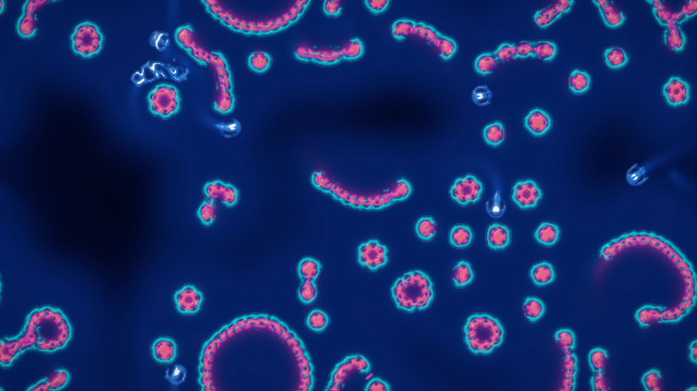
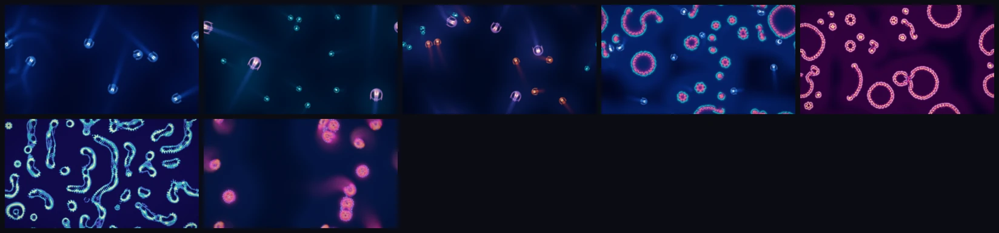

# Lenia on the GPU: continuous cellular automata and Orbium gliders



World 3 of [Primordia](../../README.md). Id `lenia`; aliases `smoothlife`, `continuous-ca`.

```bash
primordia --world lenia                          # open it in the window
primordia render -w lenia -p pearl-reef          # render a still to renders/lenia-pearl-reef-s1.png
```

## What it models

Lenia, by Bert Chan, is a cellular automaton with continuous states, space and time. Every cell holds a value
between 0 and 1. A smooth ring-shaped kernel K averages each cell's neighbourhood, a Gaussian growth function G turns
that average into growth or decay, and a small time step adds it:

```text
U_k = K_k * A_source(k)                                normalised ring kernel, 1 to 3 rings
G_k = 2 exp(-(U_k - mu_k)^2 / (2 sigma_k^2)) - 1       growth
A_c <- clip(A_c + dt * sum_k h_k G_k / sum_k h_k, 0, 1)   dt = 1/T, over the kernels that feed channel c
```

With the right mu and sigma, soft self-sustaining creatures appear, the best known being the gliding *Orbium*.
Primordia runs the multi-channel, multi-kernel form of *Lenia and Expanded Universe*:

- **Up to 3 channels and 16 kernels.** Kernels read one channel and write another, so species can ignore,
  deflect or feed on each other.
- **Direct convolution** on compute shaders. The kernel weights are normalised and precomputed, empty taps are
  skipped, and four kernels that share a source channel are evaluated together from shared-memory tiles.
- **A nursery.** Species that rarely form from random noise, such as Orbium, are hatched from their published
  pattern in many small isolated tori, and only the patches that became steady creatures are released into the
  world at random headings.
- **Revival.** When the world dies out or thins out, fresh life is dropped in (`params.revive`,
  `params.respawn`), and a per-channel quench fades explosions before they fill the torus.
- **Display.** Each channel goes through its own palette; bodies look like glass with glowing nuclei, the growth
  field adds a faint halo and every creature leaves a soft wake.

The domain has one cell per `cell_px` output pixels (2 to 4 in the presets), capped at 640,000 cells.

References: Bert Chan, [*Lenia: Biology of Artificial Life*](https://arxiv.org/abs/1812.05433), Complex Systems
28(3), 2019, and [*Lenia and Expanded Universe*](https://arxiv.org/abs/2005.03742), ALIFE 2020;
[Chakazul/Lenia](https://github.com/Chakazul/Lenia).

## Presets



| # | Preset | Character | Render it |
|---|---|---|---|
| 1 | Orbium | The classic glider *Orbium unicaudatus* (R 13, T 10, mu 0.15, sigma 0.015), hatched from its published pattern: a few large comets, each trailing a soft wake | `primordia render -w lenia -p orbium` |
| 2 | Leviathans | A few giant Orbium (R 24) among shoals of small ones (R 10), kept apart by weak cross-kernels | `primordia render -w lenia -p leviathans` |
| 3 | Menagerie | Three Orbium species at three scales (R 9, 13 and 20), each at its own brightness, keeping out of each other's way | `primordia render -w lenia -p menagerie` |
| 4 | Pearl Reef | Orbium gliders weaving between colonies of pearls that grow into rings, each side deflecting the other | `primordia render -w lenia -p pearl-reef` |
| 5 | Necklaces | The pearl species alone: rings that grow, break into arcs and bud new beads | `primordia render -w lenia -p necklaces` |
| 6 | Hydrogeminium | *Hydrogeminium natans* (R 18, T 2, a three-ring kernel): colonies of rings and amoebae that grow, divide and merge | `primordia render -w lenia -p hydrogeminium` |
| 7 | Tessellatium | *Tessellatium gyrans*: three channels and fifteen kernels, every creature made of all three channels in shifting proportions | `primordia render -w lenia -p tessellatium` |

Presets also take their number or a unique prefix: `-p 4`, `-p pearl`. Add `--seed N` for another run of the same
rules. **Mutate** (`M` in the window) nudges the kernels of a curated species and screens the result with a short
trial run, so a mutation stays a living relative of that species; `primordia explore -w lenia` searches the
mutations for the most novel behaviour (Lenia explores more slowly than the other worlds: mutations of Orbium,
Leviathans, Menagerie and Pearl Reef hatch their creatures in a nursery first, and the others are screened with trial
runs).

## Parameters worth knowing

Every setting is a `--set KEY=VALUE` away, for `render`, `recipe` and `explore`. `primordia recipe -w lenia -p
orbium` prints them all. Kernels and channels are numbered from 0 in keys.

| Key | Default (Orbium) | Meaning |
|---|---|---|
| `params.kernels.0.mu` | 0.15 | Centre of kernel 1's growth function: the neighbourhood average that grows fastest |
| `params.kernels.0.sigma` | 0.015 | Width of the growth function; narrow means fussy creatures |
| `params.kernels.0.radius` | 13 | Kernel radius R in cells (before `params.scale`) |
| `params.kernels.0.b` | [1, 0, 0] | Peak heights of the kernel's rings (`params.kernels.0.rings` of them are used) |
| `params.kernels.0.h` | 1 | Weight of the kernel among those feeding its target channel |
| `params.kernels.0.source`, `.target` | 0, 0 | Channels the kernel reads and writes |
| `params.time_res` | 10 | Time resolution T: each step advances dt = 1/T |
| `params.steps_per_frame` | 3 | Steps per displayed frame |
| `params.scale` | 1 | Multiplies every kernel radius: grows or shrinks the creatures |
| `params.cell_px` | 3.5 | Output pixels per cell: how large the creatures appear (applies on reset) |
| `params.seeding` | Nursery | How life starts: Patches, Soup, Sparse, Blobs or Nursery |
| `params.revive`, `params.respawn` | true, 0.8 | Drop fresh life into a world that dies out, and keep its mass above this share of the seeded mass |
| `params.quench.0` | 0.05 | Mean density a neighbourhood of channel 1 may reach before it fades (0 = off) |
| `palettes.0` | Glacier | Palette of channel 1 (12 palettes: `primordia list -w lenia`) |

```bash
primordia render -w lenia -p orbium --set params.kernels.0.mu=0.16 --set params.kernels.0.sigma=0.017
```

A small change of mu or sigma is often the difference between a glider, a blob that fills the torus and nothing at
all; Lenia's own [papers](https://arxiv.org/abs/1812.05433) map where the creatures live.

## Measurements

Every frame the GPU reduces the state to these numbers. The window plots them as sparklines (World tab >
Measurements), `primordia render --metrics FILE.csv` logs them, and `explore` builds its behaviour descriptor from
them. A *fraction* is a share of cells in 0-1; a *scalar* is unbounded. Explore counts a candidate as inert when a
vital measurement stays near zero.

| Id | Unit | Vital | Meaning |
|---|---|---|---|
| `mass` | scalar | yes | Mean cell value summed over the channels: the creatures' total mass per cell |
| `mass_1` | scalar | | Mean value of channel 1 |
| `mass_2` | scalar | | Mean value of channel 2 (zero when the preset uses fewer channels) |
| `mass_3` | scalar | | Mean value of channel 3 (zero when the preset uses fewer channels) |
| `occupied` | fraction | | Cells whose summed value exceeds 0.1: the creatures' footprint |
| `active` | fraction | yes | Cells whose summed value is changing by more than 0.001 per frame, judged from the last step |
| `growth` | scalar | | Mean growth rate of the last step summed over the channels: positive while creatures grow, negative while they fade |
| `dense` | fraction | | Cells whose summed value exceeds 0.5: the solid bodies of the creatures |

```bash
primordia render -w lenia -p hydrogeminium --frames 1200 --metrics hydro.csv
primordia explore -w lenia --select max:occupied --keep 8
```

## Interaction

- **Left drag** releases hatched creatures or seeds life under the cursor.
- **Right drag** erases.
- `[` and `]` change the brush size; headlessly, `render --brush primary --brush-at 0.5,0.5` holds the brush.

The **World** tab of the control panel lists every kernel with its radius, growth centre μ, growth width σ, weight
and rings, and adds or removes kernels, next to the time resolution, seeding, revival and each channel's look.

---

The other worlds: [Physarum](physarum.md) · [Particle Life](particle-life.md) ·
[Reaction-Diffusion](reaction-diffusion.md) · [Symbiosis](symbiosis.md)
