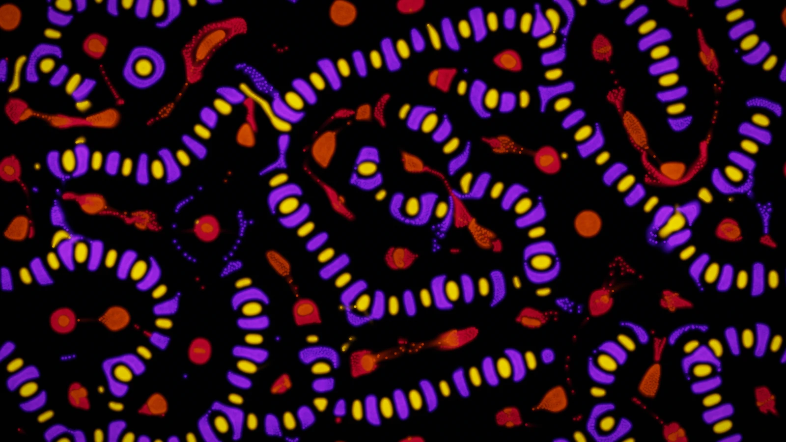
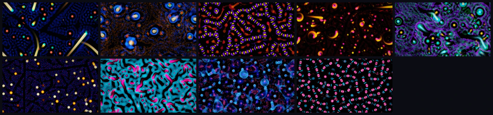

# Particle Life simulation on the GPU: asymmetric attraction and self-assembly



World 2 of [Primordia](../../README.md). Id `particle-life`; aliases `particles`, `particlelife`, `pl`, `life`.

```bash
primordia --world particle-life                     # open it in the window
primordia render -w particle-life -p serpents       # render a still to renders/particle-life-serpents-s1.png
```

## What it models

Particle life is a family of artificial-life systems built from one idea: particles of a few species, each with its
own attraction or repulsion towards every other species, and the rules need not be symmetric. Species A may chase B
while B flees A. From those pairwise rules alone come membranes, cells, serpents, rotating suns and predator-prey
chases. Primordia follows Jeffrey Ventrella's *Clusters* and Tom Mohr's force model:

- **Up to 8 species** with an attraction matrix `A[i][j]` in -1..1 (how strongly species i is drawn to species j)
  and a per-pair reach `R[i][j]`.
- **The force** depends on the distance d, normalised as r = d / (`r_max` · R[i][j]): below `beta` every pair repels
  (r / beta - 1), between `beta` and 1 a tent of attraction peaks at A[i][j], and beyond 1 there is no force.
  Friction halves the velocity every `half_life` seconds.
- **Neighbour search** is a GPU uniform grid rebuilt every step with a counting sort, and nine threads per particle
  sum the pair forces of its 3×3 block of cells.
- **Fixed-point sums.** Forces are added as integers in a fixed order, so the order in which the GPU bins particles
  does not matter: a run is repeatable from its seed on the same GPU, driver and backend. Other GPUs round the
  per-pair maths differently, and these chaotic dynamics soon diverge into a different arrangement of the same kind.
- **Resolution-independent.** The domain's area follows the particle count and density (32,768 particles by
  default, up to 262,144), and only its aspect ratio follows the output, so a preset behaves the same at any size.
- **Display.** Motion-stretched glows accumulate in an HDR trail, crisp heads are drawn on top, and one copy is drawn
  per visible torus tile, so zooming out tiles the world seamlessly.

References: Jeffrey Ventrella, [*Clusters*](https://www.ventrella.com/Clusters/); Tom Mohr,
[particle-life](https://github.com/tom-mohr/particle-life).

## Presets



| # | Preset | Character | Render it |
|---|---|---|---|
| 1 | Tidepool | A deep-blue foam of coral-nucleus cells, combed into currents by golden eels with aqua heads | `primordia render -w particle-life -p tidepool` |
| 2 | Living Cells | Membrane-bound cells of different sizes with layered nuclei, packed in an amber network; they drift, merge and coarsen | `primordia render -w particle-life -p living-cells` |
| 3 | Serpents | A writhing soup of segmented violet worms with golden beads | `primordia render -w particle-life -p serpents` |
| 4 | Rotating Suns | Each species follows the next: spinning yin-yang suns unroll into comets and roll up again, ploughing dark wakes through ember dust | `primordia render -w particle-life -p rotating-suns` |
| 5 | Lace | A spreading emerald lace with sparse gold-nucleus cells and bright swimmers darting between them | `primordia render -w particle-life -p lace` |
| 6 | Marbling | Two gases demix into a marbled labyrinth that slowly coarsens, while warm stars and comets carve dark rivers through it | `primordia render -w particle-life -p marbling` |
| 7 | Predator & Prey | Packs of big magenta hunters drag through sheets of cyan prey that stream rather than ball up | `primordia render -w particle-life -p predator-prey` |
| 8 | Plankton | A food chain: plankton clump and flee the fish, which school and flee the rare pink jellies that hunt them | `primordia render -w particle-life -p plankton` |
| 9 | Necklaces | Strings of rose and magenta beads that wander, break and re-thread, with sparse cyan shards between them | `primordia render -w particle-life -p necklaces` |

Presets also take their number or a unique prefix: `-p 7`, `-p pred`. Add `--seed N` for another run of the same
rules. **Mutate** (`M` in the window) usually takes a curated preset's matrix, relabels its species and nudges every
entry by up to ±0.2, so the preset's character survives; one time in five it rolls a fresh matrix of 3 to 5 species
instead. `primordia explore -w particle-life` searches the mutations for the most novel behaviour.

## Parameters worth knowing

Every setting is a `--set KEY=VALUE` away, for `render`, `recipe` and `explore`. `primordia recipe -w particle-life
-p tidepool` prints them all. Species are numbered from 0 in keys.

| Key | Default (Tidepool) | Meaning |
|---|---|---|
| `params.kinds` | 4 | Species in play (2-8) |
| `params.matrix.0.1` | -0.9 | How strongly species 1 is attracted to species 2 (-1..1, negative repels); row = the species that feels it |
| `params.radii.0.1` | 1 | Reach of that pair as a fraction of `r_max` |
| `params.weights.0` | 0.77 | Relative abundance of species 1 |
| `params.r_max` | 40 | Interaction radius in world units (12-120) |
| `params.beta` | 0.3 | Share of the radius where every pair repels |
| `params.force` | 10 | Overall force scale |
| `params.half_life` | 0.04 | Seconds for friction to halve a particle's velocity |
| `params.count`, `params.density` | 32768, 0.04 | Particles (2048-262144) and particles per square unit; both apply on restart |
| `params.spawn` | Uniform | Where particles start: Uniform, Clusters or Disc |
| `params.substeps` | 1 | Simulation steps per displayed frame |
| `params.colors.Scheme` | 0 | Colour scheme by number from 0 (the 11 schemes: `primordia list -w particle-life`) |
| `ground` | 132367 | Background colour as a packed sRGB number (0x02050f) |

```bash
primordia render -w particle-life -p tidepool --set params.matrix.0.1=0.5 --set params.r_max=60
```

## Measurements

Every frame the GPU reduces the state to these numbers. The window plots them as sparklines (World tab >
Measurements), `primordia render --metrics FILE.csv` logs them, and `explore` builds its behaviour descriptor from
them. A *fraction* is a share of particles or grid cells in 0-1; a *scalar* is unbounded. Explore counts a candidate
as inert when a vital measurement stays near zero.

| Id | Unit | Vital | Meaning |
|---|---|---|---|
| `speed` | scalar | yes | Mean particle speed in interaction radii per second |
| `hot` | fraction | | Particles moving faster than 1.5 radii per second: chases and boiling |
| `slow` | fraction | | Particles moving slower than 0.1 radii per second: frozen lattices and resting cells |
| `crowding` | scalar | | Mean particles per grid cell around each particle, relative to a uniform spread (1 = random, higher = clustered) |
| `dense` | fraction | | Particles whose grid cell holds more than three times the uniform expectation |
| `segregation` | scalar | | How much cell-mates share a particle's species beyond chance: 0 = mixed, 1 = pure species clusters, negative = alternating |
| `void` | fraction | | Grid cells without any particle: the open space between structures |

```bash
primordia render -w particle-life -p predator-prey --frames 1200 --metrics hunt.csv
primordia explore -w particle-life --select max:segregation --keep 8
```

## Interaction

- **Left drag** attracts particles to the cursor like a spring.
- **Right drag** repels them.
- `[` and `]` change the brush size; headlessly, `render --brush primary --brush-at 0.5,0.5` holds the brush.

The **World** tab of the control panel has the attraction matrix (with Randomise, Mirror and Transpose), the
interaction radius, friction, the species' balance and sizes, the particle count and the look. The per-pair reach
(`params.radii`) is only reachable through `--set` and recipes.

---

The other worlds: [Physarum](physarum.md) · [Lenia](lenia.md) · [Reaction-Diffusion](reaction-diffusion.md) ·
[Symbiosis](symbiosis.md)
