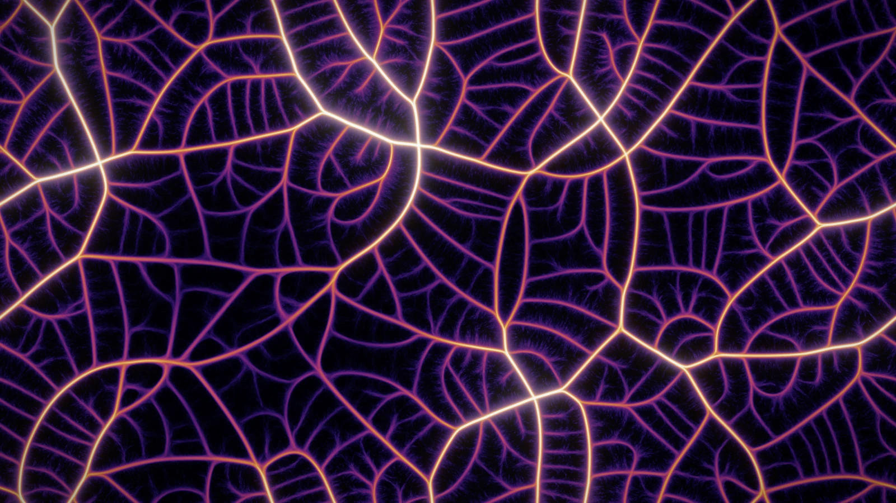
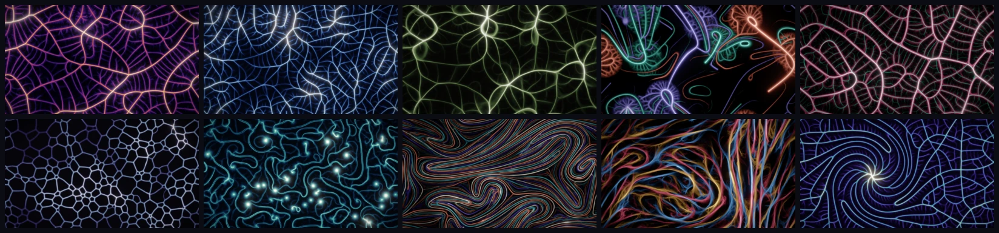

# Physarum slime mould (slime mold) simulation on the GPU



World 1 of [Primordia](../../README.md). Id `physarum`; aliases `slime`, `slime-mold`, `slime-mould`, `mold`,
`mould`.

```bash
primordia --world physarum                      # open it in the window
primordia render -w physarum -p dendrites       # render a still to renders/physarum-dendrites-s1.png
```

## What it models

*Physarum polycephalum* is a single-celled slime mould that finds short, robust networks between food sources. Jeff
Jones showed in 2010 that a crowd of very simple agents reproduces this behaviour. Every agent senses the chemical
trail at three points ahead of it (left, centre and right), turns towards the strongest signal, moves forward and
deposits more trail; the trail diffuses and decays. Out of that loop grow self-optimising transport networks:
bright arteries fed by fine capillaries that keep remodelling.

Primordia runs the model on compute shaders at a scale where the networks look alive:

- **Millions of agents.** The trail grid has one cell per output pixel, and each preset sets a density of 1.5 to
  2.5 agents per cell: about 3 to 5 million agents at 1920×1080 (Dendrites has 4.1 million), and at most 2^24 (about 16.8 million), fewer on GPUs with smaller buffer limits.
- **Up to four species.** An interaction matrix decides how strongly each species follows, ignores or flees every
  species' trail, in the spirit of Sage Jenson's work. That gives rival territories, mutual lace and cyclic chases.
- **Race-free deposits.** Agents count their deposits with integer atomics, split along each step so fast agents
  still draw continuous lines. The result does not depend on the order the GPU runs them in.
- **Terrain.** A slow, exactly periodic noise field varies how fast the trail decays across the torus, so dense
  meshes and quiet voids form and drift over the minutes.
- **Display.** Trail haze and a long exposure of the traffic go through a logarithmic tone curve, so a lone agent's
  streak stays visible while veins glow into HDR. A GPU histogram sets an adaptive black point.

References: Jeff Jones, *Characteristics of pattern formation and evolution in approximations of Physarum transport
networks*, Artificial Life 16(2), 127–153, 2010
([doi:10.1162/artl.2010.16.2.16202](https://doi.org/10.1162/artl.2010.16.2.16202)); Sage Jenson's
[*physarum*](https://cargocollective.com/sagejenson/physarum) artwork.

## Presets



| # | Preset | Character | Render it |
|---|---|---|---|
| 1 | Dendrites | One species with a soft crowding cap: tapering arteries of varied brightness, with capillaries woven through the voids | `primordia render -w physarum -p dendrites` |
| 2 | Neural Lace | A mix of agent sizes weaves a fine and a medium lace at once, crossed by sparse trunk strands | `primordia render -w physarum -p neural-lace` |
| 3 | Mycelium | Long sensors and strong wander: hyphae of every thickness, sheathed in a soft haze | `primordia render -w physarum -p mycelium` |
| 4 | Rival Colonies | Three species that dislike each other's trails, born in scattered colonies: territories with contested borders | `primordia render -w physarum -p rival-colonies` |
| 5 | Symbiosis | Two mutually attracted species at very different scales: a fine teal lace threaded along coarse rose arteries (a Physarum preset, not the [Symbiosis world](symbiosis.md)) | `primordia render -w physarum -p symbiosis` |
| 6 | Honeycomb | A wide sensor angle and small turns settle the network into polygons, some walls thickening into ribs | `primordia render -w physarum -p honeycomb` |
| 7 | Synapses | Very wide sensors, small turns and a gentle curl: meandering neurites that knot into glowing synapses | `primordia render -w physarum -p synapses` |
| 8 | Currents | Four mutually repelling species of different reach squeeze each other into lanes that meander like streamlines | `primordia render -w physarum -p currents` |
| 9 | Chasing Waves | Cyclic dominance: each species follows the next one's trail and flees the previous one's, in braided ribbons that never settle | `primordia render -w physarum -p chasing-waves` |
| 10 | Galaxy | A pull towards a centre and differential rotation wind the network into spiral arms around a glowing core | `primordia render -w physarum -p galaxy` |

Presets also take their number or a unique prefix: `-p 7`, `-p syn`. Add `--seed N` for another run of the same
rules, and `--width`/`--height` for another size (`render` defaults to 1920×1080). **Mutate** (`M` in the window) jumps to
a random new parameter set; `primordia explore -w physarum` searches the mutations for the most novel behaviour.

## Parameters worth knowing

Every setting is a `--set KEY=VALUE` away, for `render`, `recipe` and `explore`. `primordia recipe -w physarum -p
dendrites` prints them all. The ones that change the behaviour most:

| Key | Default (Dendrites) | Meaning |
|---|---|---|
| `params.species.0.sensor_angle` | 22.5 | Degrees between the centre sensor and each side sensor; wide angles give polygons |
| `params.species.0.sensor_distance` | 12 | How far ahead the sensors reach, in cells; longer gives coarser networks |
| `params.species.0.turn_angle` | 45 | Degrees an agent turns when it steers |
| `params.species.0.speed` | 1.2 | Cells travelled per sub-step |
| `params.species.0.wander` | 1 | Random heading jitter, in degrees |
| `params.species.0.curl` | 0 | Constant turn per sub-step in degrees, which curls paths into vortices |
| `params.interact.0.1` | 0 | How strongly species 1 follows species 2's trail (negative flees it); row = follower |
| `params.decay` | 0.97 | Fraction of the trail kept per sub-step |
| `params.diffusion` | 1 | Blend between the trail and its 3×3 mean each sub-step |
| `params.crowding` | 8 | Agents per cell beyond which extra agents add little trail (0 = linear) |
| `params.renewal` | 0.002 | Probability per sub-step that an agent is reborn at the spawn layout |
| `params.terrain` | 2.2 | How strongly the terrain varies the decay (0 = uniform ground) |
| `params.swirl`, `params.gravity` | 0, 0 | Differential rotation about the centre, and a pull towards it (Galaxy) |
| `params.steps_per_frame` | 3 | Sub-steps per displayed frame (up to 12) |
| `population.species`, `population.layout` | 1, Scatter | Live species (1-4) and where agents spawn: Scatter, DiskOut, DiskIn, Rings, Sectors, Bands, Clusters, Vortex or Galaxy |
| `palette` | Ember Gold | One of 18 palettes (`primordia list -w physarum`); `params.color_mode=Species` colours each species instead |

Species are numbered from 0 in keys (`params.species.2.speed` is the third species). For example:

```bash
primordia render -w physarum -p dendrites --set params.species.0.sensor_angle=60 --set palette=Frost
```

## Measurements

Every frame the GPU reduces the state to these numbers. The window plots them as sparklines (World tab >
Measurements), `primordia render --metrics FILE.csv` logs them, and `explore` builds its behaviour descriptor from
them. A *fraction* is a share of cells or agents in 0-1; a *scalar* is unbounded. Explore counts a candidate as
inert when a vital measurement stays near zero.

| Id | Unit | Vital | Meaning |
|---|---|---|---|
| `ground` | fraction | yes | Cells holding at least a tenth of the trail an even spread of the agents would leave |
| `veins` | fraction | | Cells holding more than four times the trail of an even spread: the network's arteries |
| `concentration` | scalar | | Mean log2 of the relative trail density: an even spread gives 0, and the value drops the more the trail gathers into a network |
| `travelled` | fraction | | Cells whose long-exposure traffic is at least a quarter of an even spread |
| `trail_mass` | scalar | | Mean relative trail density; about 1, shifted by terrain and crowding |
| `reinforced` | fraction | | Cells whose trail grew during the last step, against those decaying |
| `on_vein` | fraction | | Agents standing on a cell where their own species' trail exceeds four times an even spread |
| `agent_trail` | scalar | | Mean relative trail density of the agents' own species under them: about 1 when scattered, far more on a network |

```bash
primordia render -w physarum -p honeycomb --frames 1200 --metrics honeycomb.csv
primordia explore -w physarum --select max:veins --keep 8
```

## Interaction

- **Left drag** drops food: agents gather into a hub where you hold the button.
- **Right drag** pushes agents away and erases trails.
- `[` and `]` change the brush size; headlessly, `render --brush primary --brush-at 0.5,0.5` holds the brush.

The **World** tab of the control panel exposes every parameter above, with a section per species that includes its
attraction to every trail. Changes to the population (agent count, species, layout) wait for **Apply** or a reset.

---

The other worlds: [Particle Life](particle-life.md) · [Lenia](lenia.md) ·
[Reaction-Diffusion](reaction-diffusion.md) · [Symbiosis](symbiosis.md)
