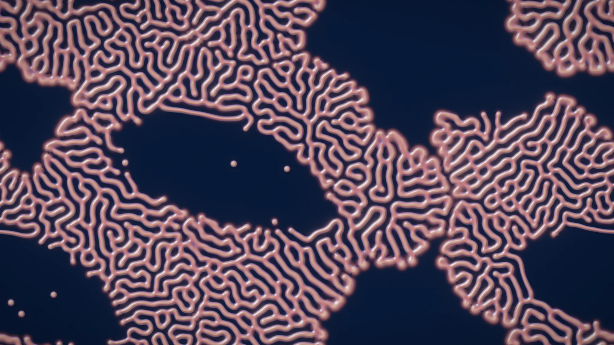
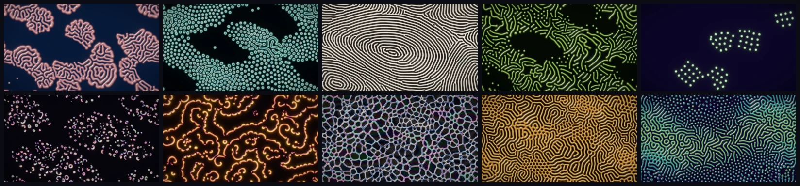

# Gray-Scott reaction-diffusion simulation on the GPU



World 4 of [Primordia](../../README.md). Id `reaction-diffusion`; aliases `rd`, `gray-scott`, `grayscott`,
`turing`, `coral`.

```bash
primordia --world reaction-diffusion             # open it in the window
primordia render -w rd -p mitosis                # render a still to renders/reaction-diffusion-mitosis-s1.png
```

## What it models

Two virtual chemicals, a substrate U and an activator V, react and diffuse. V turns U into more V (`U + 2V → 3V`),
fresh U is fed in at a rate F, and V is removed at a rate F + k:

```text
dU/dt = Du ∇²U - U V² + F (1 - U)
dV/dt = Dv ∇²V + U V² - (F + k) V
```

This is the Gray-Scott model, and John Pearson's 1993 map of its (F, k) plane shows how rich it is: depending on the
feed and kill rates the same two equations paint coral, dividing cells, fingerprints, worms, solitons, crescent
gliders, spiral waves or soap-film foam. Reaction and diffusion together are the mechanism Alan Turing proposed in
1952 as the chemical basis of morphogenesis.

Primordia integrates the equations with Karl Sims' 3×3 Laplacian on ping-ponged buffers, with 12 to 32 explicit
steps per displayed frame, and adds a few slow modulations that keep every pattern alive and composed:

- **Weather.** The kill rate drifts slowly across the torus (`params.drift`), and the pattern size varies from place
  to place (`params.scale_var`).
- **Lagoons.** A few large, drifting regions of extra kill (`params.ground`) keep open ground that the pattern
  re-colonises as they move on.
- **Ridge flow.** Anisotropic diffusion along a whorled flow (`params.aniso`) turns labyrinths into fingerprint
  ridges with loops, whorls and deltas.
- **Revival.** When the field has been uniform for half a second and nobody is painting, it restarts once: an empty
  field gets fresh seeds, a flooded one gets holes of bare chemistry punched into it, and the foam regimes get fresh
  foam.
- **The Morphology Atlas.** With `params.atlas` on, feed and kill vary smoothly across the domain, so Pearson's whole
  zoo lives side by side on one seamless torus.
- **Display.** The field is lit as a height map in one of five materials (Lacquer, Nacre with a thin-film sheen,
  Luminous, Ink on paper, and DarkField), with auto-contrast from a GPU histogram.

The domain has two cells for every three output pixels along each axis: 1280×720 cells at 1920×1080.

References: John E. Pearson, *Complex Patterns in a Simple System*, Science 261(5118), 189–192, 1993
([doi:10.1126/science.261.5118.189](https://doi.org/10.1126/science.261.5118.189)); Karl Sims'
[reaction-diffusion tutorial](https://www.karlsims.com/rd.html); Robert Munafo's
[xmorphia](https://www.mrob.com/pub/comp/xmorphia/).

## Presets



| # | Preset | Character | Render it |
|---|---|---|---|
| 1 | Coral Reef | Branching coral colonies (F 0.0545, k 0.062) in glossy lacquer relief | `primordia render -w rd -p coral-reef` |
| 2 | Mitosis | Spots that grow and divide like cells (F 0.0367, k 0.0649), glowing on a dark field | `primordia render -w rd -p mitosis` |
| 3 | Fingerprints | Stripes steered by the ridge flow into loops, whorls and deltas, in ink on paper | `primordia render -w rd -p fingerprints` |
| 4 | Worms | Dense, wriggling worms (F 0.058, k 0.065) | `primordia render -w rd -p worms` |
| 5 | Solitons | Just below where spots stop budding: sparse seeds grow into rafts of glowing orbs that bud slowly at their rims | `primordia render -w rd -p solitons` |
| 6 | Crescent Gliders | Swarms of mobile crescents (F 0.014, k 0.050) streaming around lethal lagoons, in nacre | `primordia render -w rd -p crescent-gliders` |
| 7 | Spiral Waves | Excitable fronts (F 0.010, k 0.045) that curl into rotating spirals | `primordia render -w rd -p spiral-waves` |
| 8 | Bubbles | Soap-film foam: thin walls around empty cells (F 0.090, k 0.0597) | `primordia render -w rd -p bubbles` |
| 9 | Spots & Stripes | A touch above the critical kill: the weather sweeps stripes into honeycomb and back | `primordia render -w rd -p spots-stripes` |
| 10 | Morphology Atlas | Feed and kill sweep across the torus, so every regime above lives on one map | `primordia render -w rd -p morphology-atlas` |

Presets also take their number or a unique prefix: `-p 7`, `-p spi`. Add `--seed N` for another run of the same
rules. **Mutate** (`M` in the window) samples feed and kill inside regions of the map that stay alive from their
seeding; `primordia explore -w rd` searches the mutations for the most novel behaviour.

## Parameters worth knowing

Every setting is a `--set KEY=VALUE` away, for `render`, `recipe` and `explore`. `primordia recipe -w rd -p
coral-reef` prints them all.

| Key | Default (Coral Reef) | Meaning |
|---|---|---|
| `params.feed` | 0.0545 | Feed rate F: how fast fresh U flows in |
| `params.kill` | 0.062 | Kill rate k: how fast V is removed (on top of F) |
| `params.scale` | 1.2 | Diffusion of U; the pattern size grows with its square root |
| `params.ratio` | 2 | Du / Dv |
| `params.steps_per_frame` | 12 | Integration steps per displayed frame |
| `params.seeding` | Sparse | How the chemistry starts: Sparse, Blobs, Noise, Dense, Square, Foam, Rings, Center or Fronts |
| `params.drift`, `params.drift_speed` | 0.0006, 1 | Amplitude and speed of the kill-rate weather |
| `params.scale_var` | 0.2 | How much the pattern size varies across the torus |
| `params.ground` | 0.005 | Kill added inside the drifting lagoons |
| `params.aniso` | 0 | Strength of the fingerprint ridge flow |
| `params.rain` | 0 | Expected automatic droplets per frame |
| `params.atlas` | false | Vary feed and kill across the domain (the Morphology Atlas) |
| `params.material` | Lacquer | Lacquer, Nacre, Luminous, Ink or DarkField |
| `palette` | Coral | One of 12 palettes (`primordia list -w rd`) |

```bash
primordia render -w rd -p coral-reef --set params.feed=0.037 --set params.kill=0.06 --set params.material=Nacre
```

## Measurements

Every frame the GPU reduces the state to these numbers. The window plots them as sparklines (World tab >
Measurements), `primordia render --metrics FILE.csv` logs them, and `explore` builds its behaviour descriptor from
them. A *fraction* is a share of cells in 0-1; a *scalar* is unbounded. Explore counts a candidate as inert when a
vital measurement stays near zero.

| Id | Unit | Vital | Meaning |
|---|---|---|---|
| `alive` | fraction | yes | Cells whose V exceeds 0.03: the footprint of the pattern |
| `body` | fraction | | Cells whose V exceeds 0.25: the solid interior of spots, stripes and worms |
| `v_mean` | scalar | | Mean concentration of the activator V |
| `u_mean` | scalar | | Mean concentration of the substrate U |
| `active` | fraction | yes | Cells whose V is changing by more than 0.001 per frame, judged from the last step: zero once a pattern has frozen |
| `v_drift` | scalar | | Mean change of V per step: positive while the pattern spreads, negative while it dies back |
| `edge` | fraction | | Alive cells with a dead neighbour: the pattern's perimeter, high for fine labyrinths and low for blobs |
| `filled` | fraction | | Cells whose V exceeds 0.4: flooded ground, the state the revive logic watches for |

```bash
primordia render -w rd -p mitosis --frames 1200 --metrics mitosis.csv
primordia explore -w rd --select max:edge --keep 8
```

## Interaction

- **Left drag** sprays seeds of V; in Bubbles it blows fresh foam.
- **Right drag** erases back to bare U; in Bubbles it pops bubbles.
- `[` and `]` change the brush size; headlessly, `render --brush primary --brush-at 0.5,0.5` holds the brush.

The **World** tab of the control panel has the chemistry (feed, kill, diffusion, the atlas), the weather, the
seeding and the material and lighting.

---

The other worlds: [Physarum](physarum.md) · [Particle Life](particle-life.md) · [Lenia](lenia.md) ·
[Symbiosis](symbiosis.md)
