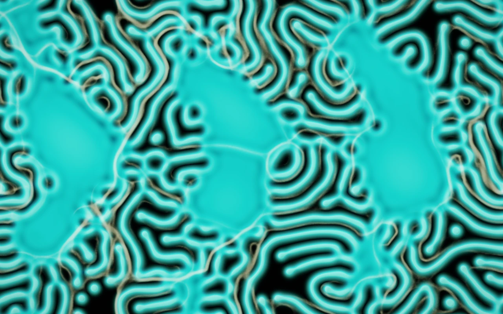
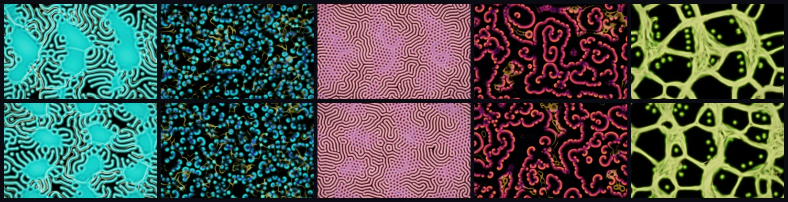
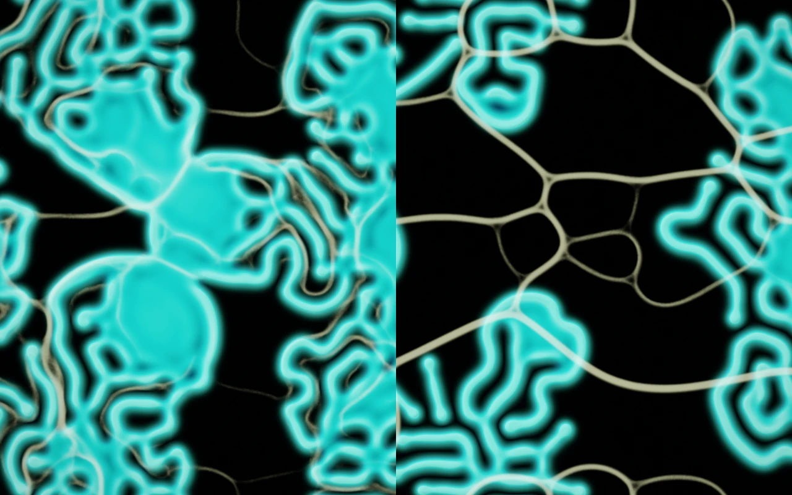
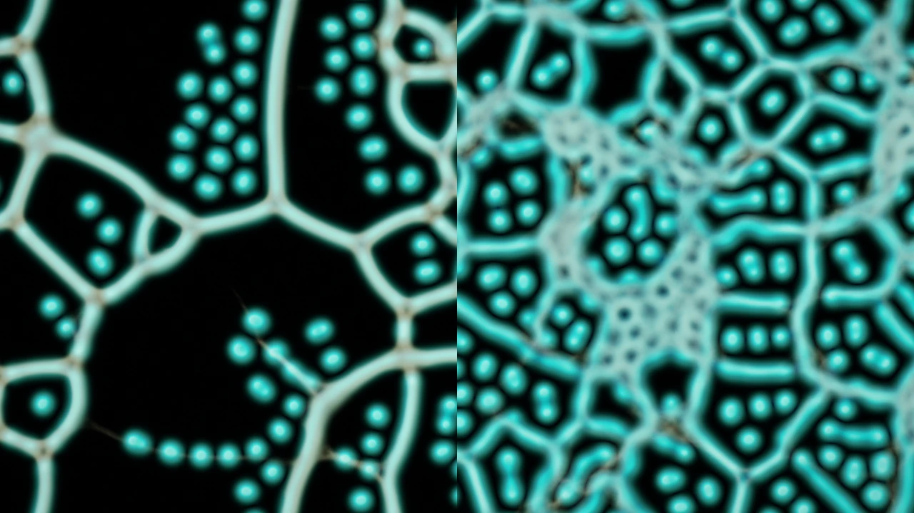
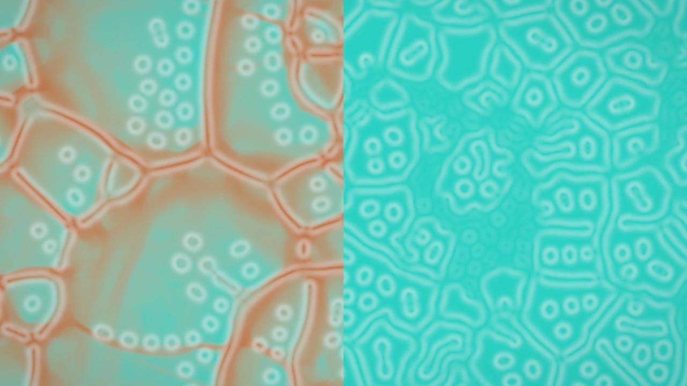

# Symbiosis: coupled agents and reaction-diffusion chemistry on the GPU



World 5 of [Primordia](../../README.md). Id `symbiosis`; aliases `coupled`, `hybrid`, `ecosystem`.

```bash
primordia --world symbiosis                           # open it in the window
primordia render -w symbiosis -p wandering-veins      # render a still to renders/symbiosis-wandering-veins-s1.png
```

## What it models

Symbiosis is an experiment that puts two of Primordia's systems in one habitat and lets them shape each other:
Gray-Scott chemistry (as in [Reaction-Diffusion](reaction-diffusion.md)) and trail-following agents (as in
[Physarum](physarum.md)). Agents sense chemical growth alongside their own trails, and their trails feed back into
the chemistry. How they feed back is the **relationship**:

- **Cultivate.** Agents tend growth margins; their trails nourish existing colonies.
- **Graze.** Agents seek growth and consume it, leaving depleted routes that recover behind them.
- **Weave.** Agents follow growth, and their busiest trails germinate new living threads.

One **Coupling strength** scales both directions. At zero the chemistry and the agents keep running side by side,
each unaware of the other, which makes coupling the experiment's control.

Around that core:

- **Habitat and growth.** A seamless fertility landscape, made of fixed integer-frequency harmonics generated from
  the seed, varies how easily growth takes hold (`params.terrain`), and the growth scale sets the pattern size
  (`params.scale`). The seeding layout is scattered islands, clustered colonies, living threads or broken wave
  fronts.
- **A fertility cycle** gives the ground a slower memory. Concentrated traffic depletes local reserves, which
  increases chemical loss and makes new growth harder to germinate; when traffic moves away, the ground recovers.
  **Depletion strength** sets the effect (zero bypasses it) and **Recovery time** is the time to recover about 63%
  of the missing fertility on rested ground, at 60 simulation frames per second. Recovery follows simulation frames,
  pauses with the world, and does not depend on the chemical steps or the growth scale. Coupling at zero also
  removes depletion and its effects. Fertility costs eight bytes per cell.
- **A bounded grid.** The habitat has one cell per two output pixels, and at most 1280 cells on its longer side, so
  large displays stay responsive: 960×540 cells with about 311,000 agents at 1920×1080.

## Presets



| # | Preset | Relationship | Character | Render it |
|---|---|---|---|---|
| 1 | Living Reef | Cultivate | Broad colonies, folded margins and fine supporting trails | `primordia render -w symbiosis -p living-reef` |
| 2 | Wandering Veins | Graze | Small moving crescents pursued by roaming agents | `primordia render -w symbiosis -p wandering-veins` |
| 3 | Coral Maze | Weave | Fine, branching mazes mixed with cellular patches | `primordia render -w symbiosis -p coral-maze` |
| 4 | Spore Tide | Graze | Broken fronts curl into travelling waves and spirals | `primordia render -w symbiosis -p spore-tide` |
| 5 | Root Atlas | Weave | Large, persistent routes become corridors of chemical growth | `primordia render -w symbiosis -p root-atlas` |
| 6 | Fallow Gardens | Weave | Busy routes exhaust the ground; rested patches slowly regain fertility | `primordia render -w symbiosis -p fallow-gardens` |

Presets also take their number or a unique prefix: `-p 6`, `-p fallow`. Add `--seed N` for another habitat. In the
window, **Mutate** explores seeding layouts, scale, geography, agent behaviour and fertility cycles across all six
preset families, and `primordia explore -w symbiosis` searches those mutations for the most novel behaviour.

## Views, comparison and the fertility cycle

Switch the **View** between Together, Chemistry, Agent trails and Fertility to inspect the interaction. Changes to
the relationship and the coupling take effect immediately; the habitat carries its history forward. **Restart this
seed** applies a new seeding layout. **Trail light**, under Look, balances the visible network against the
chemistry.

**Compare habitats** restarts two habitats from the same seed. The left one uses your settings; the right one is a
reference with **Coupling off** or **Fertility cycle off**. The latter keeps the agent-chemistry coupling and removes
only depletion and its effects. All other settings, brush strokes, pan and zoom are shared. Changing the reference
or choosing **Restart comparison** repeats the experiment from that seed with your current settings; turning
comparison off keeps the left habitat running. Press **H** or **Tab** to give both panes more room. Comparison runs
two simulations, so it takes more GPU time and memory.



The same experiment headlessly (the `params.compare` setting is the Compare habitats switch):

```bash
primordia render -w symbiosis -p living-reef --seed 42 --frames 720 --set params.compare=true --width 1280 --height 800
```

The **Fertility** view shows rust for exhausted ground and teal for fertile ground, with faint colony outlines.
Clearing chemistry leaves this history intact; restarting restores full reserves. **Fallow Gardens** starts with the
cycle enabled and compares against the fertility-off reference; the other presets, and recipes saved before the
cycle existed, keep depletion off.



At the same moment the Fertility view shows the depleted routes on the left, while the reference keeps full
reserves. In this seed-42 experiment the cycle leaves larger open regions between routes, where the reference grows
a denser mesh. Both habitats stay active through 7200 frames (two minutes at 60 frames per second).



```bash
primordia render -w symbiosis -p fallow-gardens --seed 42 --frames 6000 --set params.compare=true --width 1280 --height 720
primordia render -w symbiosis -p fallow-gardens --seed 42 --frames 6000 --set params.compare=true --set params.layer=Fertility --width 1280 --height 720
primordia render -w symbiosis -p fallow-gardens --seed 42 --frames 7200 --metrics fallow.csv
```

The library keeps the relationship, habitat, seed, settings, palette, view, comparison mode and reference. Recipes
saved before these features existed keep their original behaviour: cultivation, a uniform habitat, the original
seeding, no fertility cycle and the coupling-off reference.

## Parameters worth knowing

Every setting is a `--set KEY=VALUE` away, for `render`, `recipe` and `explore`. `primordia recipe -w symbiosis -p
living-reef` prints them all.

| Key | Default (Living Reef) | Meaning |
|---|---|---|
| `params.relationship` | Cultivate | Cultivate, Graze or Weave |
| `params.coupling` | 0.7 | Strength of both cross-system terms (0 = independent systems) |
| `params.feed`, `params.kill` | 0.0545, 0.063 | Gray-Scott feed and kill rates of the chemistry |
| `params.steps` | 12 | Chemical steps per displayed frame |
| `params.sensor_distance`, `params.sensor_angle`, `params.turn_angle` | 12, 0.65, 0.4 | Agent sensing and steering (angles in radians) |
| `params.speed`, `params.wander` | 1.4, 0.08 | Agent speed in cells per displayed frame, and heading jitter |
| `params.retention` | 0.92 | Trail kept over one displayed frame |
| `params.seeding` | Archipelago | Islands (scattered islands), Archipelago (clustered colonies), Threads (living threads) or Fronts (broken wave fronts) |
| `params.terrain`, `params.scale` | 0.8, 1.35 | Strength of the fertility landscape and the growth scale |
| `params.depletion`, `params.recovery` | 0, 30 | Fertility cycle: depletion strength (0 = off) and recovery time in seconds |
| `params.layer` | Together | View: Together, Chemistry, Trails or Fertility |
| `params.compare`, `params.reference` | false, CouplingOff | Compare habitats, against CouplingOff or FertilityOff |
| `params.trail_light` | 0.55 | How brightly the agent network is drawn over the chemistry |
| `palette` | Bioluminescence | One of 12 palettes (`primordia list -w symbiosis`) |

```bash
primordia render -w symbiosis -p living-reef --set params.relationship=Graze --set params.coupling=0.9
```

## Measurements

Every frame the GPU reduces the state to these numbers. The window plots them as sparklines (World tab >
Measurements), `primordia render --metrics FILE.csv` logs them, and `explore` builds its behaviour descriptor from
them. In comparison mode every card carries two traces, your habitat in teal and the reference in amber, and CSV
logs get one row per frame and habitat. A *fraction* is a share of cells or agents in 0-1; a *scalar* is unbounded.
Explore counts a candidate as inert when a vital measurement stays near zero.

| Id | Unit | Vital | Meaning |
|---|---|---|---|
| `growth_cover` | fraction | yes | Cells whose activator V exceeds 0.1: the extent of the chemical colonies |
| `growth_mean` | scalar | | Mean activator concentration V over the habitat |
| `growth_active` | fraction | yes | Cells whose V is changing by more than 0.001 per frame, judged from the last chemistry step: how much of the pattern is still evolving |
| `growth_drift` | scalar | | Mean change of V per chemistry step: positive while colonies grow, negative while they die back |
| `routes` | fraction | | Cells whose trail exceeds 0.6, the level from which traffic wears the ground: a tight network covers few, a diffuse one many |
| `fertility_mean` | scalar | | Mean ground fertility; 1 is fully rested ground |
| `exhausted` | fraction | | Cells whose fertility has fallen below 0.5 |
| `agents_on_growth` | fraction | | Share of agents standing on a cell with growth (V above 0.1) |

```bash
primordia explore -w symbiosis --select max:growth_cover --keep 8 --refine 0
```

## Interaction

- **Left drag** seeds chemistry.
- **Right drag** clears chemistry and trails.
- In comparison mode the brush affects both habitats at the same place.
- `[` and `]` change the brush size; headlessly, `render --brush primary --brush-at 0.5,0.5` holds the brush.

---

The other worlds: [Physarum](physarum.md) · [Particle Life](particle-life.md) · [Lenia](lenia.md) ·
[Reaction-Diffusion](reaction-diffusion.md)
